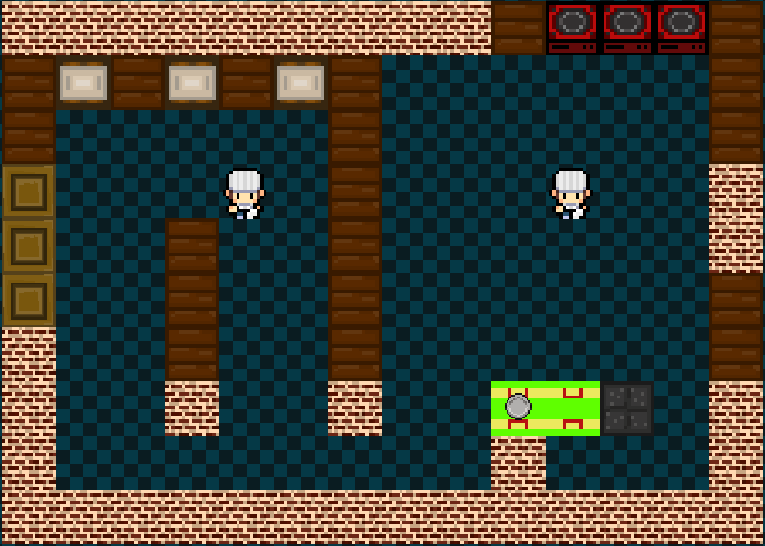

# 🍣 OOP Overcooked - Kitchen Chaos!



> **Selamat datang di dapur paling kacau!**
> Siapkan bahan, potong, masak, dan sajikan pesanan sebelum pelanggan marah. Hati-hati jangan sampai gosong! 🔥

## 📖 Tentang Proyek
**OOP Overcooked** adalah game simulasi memasak *fast-paced* yang dibangun menggunakan **Java** (Swing/AWT). Proyek ini merupakan Tugas Besar (Tubes) untuk mata kuliah Pemrograman Berorientasi Objek (OOP) Kelompok 02.

Tujuan utama game ini adalah melatih manajemen waktu dan koordinasi dalam menyiapkan menu seperti Sushi dan hidangan laut lainnya.

## ✨ Fitur Utama
* **Gameplay Intens:** Berpacu dengan waktu untuk menyelesaikan pesanan.
* **Beragam Station:**
    * 🔪 **Cutting Station:** Potong timun dan ikan.
    * 🔥 **Cooking Station:** Rebus nasi atau goreng udang.
    * 🛠️ **Assembly Station:** Gabungkan bahan menjadi hidangan lezat.
    * 🗑️ **Trash Station:** Buang bahan yang salah (atau gosong).
* **Menu Lezat:** Siapkan *Kappa Maki*, *Ebi Maki*, *Sakana Maki*, dan lainnya!
* **Mekanik OOP:** Penerapan konsep *Inheritance*, *Polymorphism*, dan *Encapsulation*.

## 🎮 Kontrol (Keyboard)

| Tombol | Aksi | Deskripsi |
| :---: | :--- | :--- |
| **W, A, S, D** | **Gerakan** | Menggerakkan karakter (Atas, Kiri, Bawah, Kanan). |
| **V** | **Action** | Melakukan aksi (memotong, memasak, mencuci). |
| **C** | **Interact** | Mengambil atau meletakkan item. |
| **B** | **Switch** | Mengganti interaksi/karakter. |
| **L** | **Dash** | Berlari cepat. |
| **T** | **Throw** | Melempar bahan. |

## 🛠️ Tech Stack
* **Bahasa:** Java (JDK 8+)
* **Library:** Java Swing & AWT
* **Build Tool:** Gradle

## 🚀 Cara Menjalankan Game

### Prasyarat
Pastikan sudah terinstall:
* Java Development Kit (JDK)
* Gradle

### Cara 1: Menggunakan IntelliJ IDEA (Recommended)
1.  Buka IntelliJ IDEA.
2.  Pilih **Open** dan buka folder project `K02-L_TUBES_OOP-gradle`.
3.  Tunggu proses *sync* Gradle selesai.
4.  Buka file `src/main/Main.java`.
5.  Klik tombol **Run** (▶️).

### Cara 2: Menggunakan Terminal
Jalankan perintah berikut di terminal root folder project:

```bash
# Untuk Linux/Mac
./gradlew run

# Untuk Windows
gradlew run
